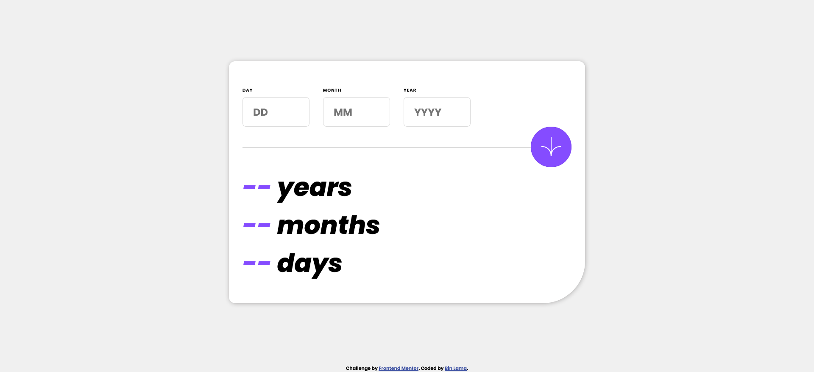
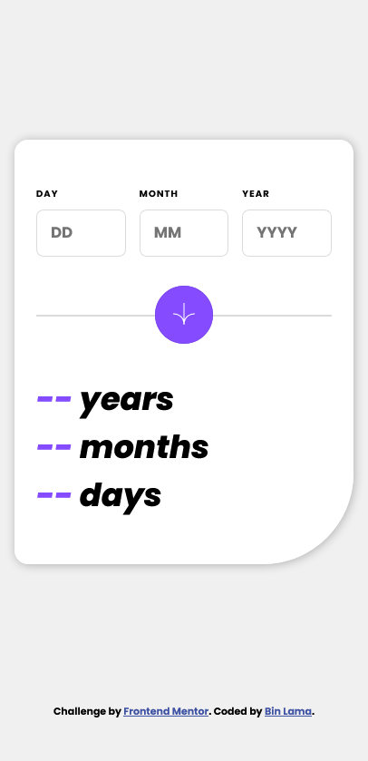

# Frontend Mentor - Age calculator app

This is a solution to the [Age calculator app challenge on Frontend Mentor](https://www.frontendmentor.io/challenges/age-calculator-app-dF9DFFpj-Q). Frontend Mentor challenges help you improve your coding skills by building realistic projects.

## Table of contents

-   [Overview](#overview)
    -   [The challenge](#the-challenge)
    -   [Screenshot](#screenshot)
    -   [Links](#links)
-   [My process](#my-process)
    -   [Built with](#built-with)
    -   [What I learned](#what-i-learned)
    -   [Continued development](#continued-development)
-   [Useful resources](#useful-resources)
-   [Author](#author)

## Overview

### The challenge

Users should be able to:

-   View an age in years, months, and days after submitting a valid date through the form
-   Receive validation errors if:
    -   Any field is empty when the form is submitted
    -   The day number is not between 1-31
    -   The month number is not between 1-12
    -   The year is in the future
    -   The date is invalid e.g. 31/04/1991 (there are 30 days in April)
-   View the optimal layout for the interface depending on their device's screen size
-   See hover and focus states for all interactive elements on the page
-   **Bonus**: See the age numbers animate to their final number when the form is submitted

### Screenshot

**Desktop View**


**Mobile View**


### Links

-   [Solution Github](https://github.com/BinLama/FrontendMentor-age-calculator-app)

-   [Live Site](https://binlama.github.io/FrontendMentor-age-calculator-app/)

## My process

### Built with

-   React (useContext, useState, useEffect) - JS library
-   CSS custom properties
-   Flexbox
-   Mobile-first workflow

### What I learned

##### First lesson

Biggest lesson that I learned was that when you are not sure when and what to update, using useEffect and setTimeout will make it hard to keep track of all the updates. I initialized useEffect and setTimeout as such:

```js
useEffect(() => {
    const interval = setTimeout(() => {
        // do some calculation
        // update age so that setTimeout is called again
    }, 50);

    return () => {
        // cleaning timeout function so that I don't get bugs
        clearTimeout(interval);
    };
}, [age]);
```

However, I was getting infinite loops on updates where the value of age was 0. It made me realized that if I don't know when to clear the timeout, I am just guessing. So, when I searched online and found that I can control when to end with setInterval I decided to use it for animating numbers. The code that I used was as follows:

```js
useEffect(() => {
    const interval = setInterval(() => {
        // do some calculation
        // if some condition meet, clear the interval
    }, 50);

    // only call interval when value has changed.
}, [value]);
```

This fixed my biggest bug, infinite updating of numbers.

##### Second lesson

When making logic, make sure to clearly test your logic and if possible bring in other people to test your code even when all you have is just barebone structure.

There were times when I thought my age calculations worked but I realized that I was not doing it correctly when I started randomly inputing date and letting my family play with it. So, note for my future self is test your logic.

##### Continued development

I want to work with more problems that require solving problems and not just design. I think I have a good grasp on following the design but calculating age was harder and took more time than styling with css.

In addition, I also want to learn tailwind css and see how I can use it on my projects.

### Useful resources

-   [animating counter](https://dev.to/cooljasonmelton/building-an-animated-counter-with-react-and-css-59ee) - This helped me learn about animating number and also helped me realized that I was approaching the problem wrong.

-   [age calculation](https://stackoverflow.com/questions/7833709/calculating-age-in-months-and-days) - Learned how to calculate age

## Author

-   Frontend Mentor - [@BinLama](https://www.frontendmentor.io/profile/BinLama)
-   Github - [@BinLama](https://github.com/BinLama)
